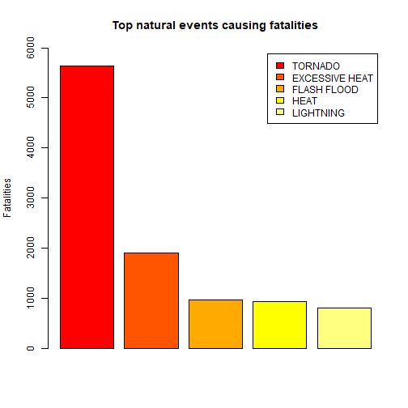
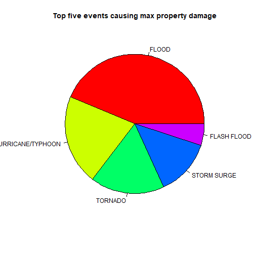
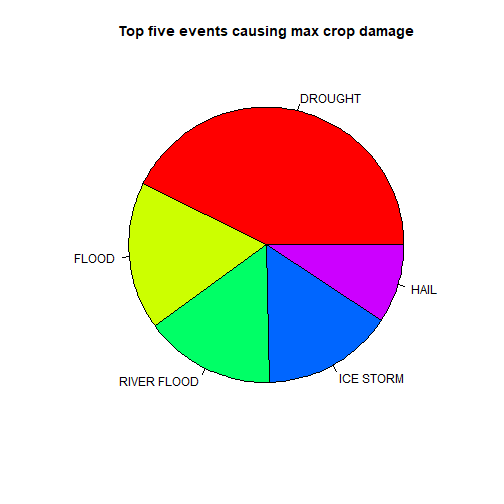

## Synopsis

This  project involves exploring the U.S. National Oceanic and Atmospheric Administration's (NOAA) storm database and effect various natural events have on humans and economy . This database tracks characteristics of major storms and weather events in the United States, including when and where they occur, as well as estimates of any fatalities, injuries, and property damage.The analysys show that tornado has the harmfull effect on humans, flood causes the most property damage, while drought crop demage .

## Data processing

Data imported from [Storme data](https://d396qusza40orc.cloudfront.net/repdata%2Fdata%2FStormData.csv.bz2)

Raw data structure:


```r
storm_data<-read.csv("StormData.csv")
```

```
## Warning in file(file, "rt"): cannot open file 'StormData.csv': No such file
## or directory
```

```
## Error in file(file, "rt"): cannot open the connection
```

```r
str(storm_data)
```

```
## 'data.frame':	902297 obs. of  37 variables:
##  $ STATE__   : num  1 1 1 1 1 1 1 1 1 1 ...
##  $ BGN_DATE  : Factor w/ 16335 levels "1/1/1966 0:00:00",..: 6523 6523 4242 11116 2224 2224 2260 383 3980 3980 ...
##  $ BGN_TIME  : Factor w/ 3608 levels "00:00:00 AM",..: 272 287 2705 1683 2584 3186 242 1683 3186 3186 ...
##  $ TIME_ZONE : Factor w/ 22 levels "ADT","AKS","AST",..: 7 7 7 7 7 7 7 7 7 7 ...
##  $ COUNTY    : num  97 3 57 89 43 77 9 123 125 57 ...
##  $ COUNTYNAME: Factor w/ 29601 levels "","5NM E OF MACKINAC BRIDGE TO PRESQUE ISLE LT MI",..: 13513 1873 4598 10592 4372 10094 1973 23873 24418 4598 ...
##  $ STATE     : Factor w/ 72 levels "AK","AL","AM",..: 2 2 2 2 2 2 2 2 2 2 ...
##  $ EVTYPE    : Factor w/ 985 levels "   HIGH SURF ADVISORY",..: 834 834 834 834 834 834 834 834 834 834 ...
##  $ BGN_RANGE : num  0 0 0 0 0 0 0 0 0 0 ...
##  $ BGN_AZI   : Factor w/ 35 levels "","  N"," NW",..: 1 1 1 1 1 1 1 1 1 1 ...
##  $ BGN_LOCATI: Factor w/ 54429 levels "","- 1 N Albion",..: 1 1 1 1 1 1 1 1 1 1 ...
##  $ END_DATE  : Factor w/ 6663 levels "","1/1/1993 0:00:00",..: 1 1 1 1 1 1 1 1 1 1 ...
##  $ END_TIME  : Factor w/ 3647 levels ""," 0900CST",..: 1 1 1 1 1 1 1 1 1 1 ...
##  $ COUNTY_END: num  0 0 0 0 0 0 0 0 0 0 ...
##  $ COUNTYENDN: logi  NA NA NA NA NA NA ...
##  $ END_RANGE : num  0 0 0 0 0 0 0 0 0 0 ...
##  $ END_AZI   : Factor w/ 24 levels "","E","ENE","ESE",..: 1 1 1 1 1 1 1 1 1 1 ...
##  $ END_LOCATI: Factor w/ 34506 levels "","- .5 NNW",..: 1 1 1 1 1 1 1 1 1 1 ...
##  $ LENGTH    : num  14 2 0.1 0 0 1.5 1.5 0 3.3 2.3 ...
##  $ WIDTH     : num  100 150 123 100 150 177 33 33 100 100 ...
##  $ F         : int  3 2 2 2 2 2 2 1 3 3 ...
##  $ MAG       : num  0 0 0 0 0 0 0 0 0 0 ...
##  $ FATALITIES: num  0 0 0 0 0 0 0 0 1 0 ...
##  $ INJURIES  : num  15 0 2 2 2 6 1 0 14 0 ...
##  $ PROPDMG   : num  25 2.5 25 2.5 2.5 2.5 2.5 2.5 25 25 ...
##  $ PROPDMGEXP: Factor w/ 19 levels "","-","?","+",..: 17 17 17 17 17 17 17 17 17 17 ...
##  $ CROPDMG   : num  0 0 0 0 0 0 0 0 0 0 ...
##  $ CROPDMGEXP: Factor w/ 9 levels "","?","0","2",..: 1 1 1 1 1 1 1 1 1 1 ...
##  $ WFO       : Factor w/ 542 levels ""," CI","$AC",..: 1 1 1 1 1 1 1 1 1 1 ...
##  $ STATEOFFIC: Factor w/ 250 levels "","ALABAMA, Central",..: 1 1 1 1 1 1 1 1 1 1 ...
##  $ ZONENAMES : Factor w/ 25112 levels "","                                                                                                               "| __truncated__,..: 1 1 1 1 1 1 1 1 1 1 ...
##  $ LATITUDE  : num  3040 3042 3340 3458 3412 ...
##  $ LONGITUDE : num  8812 8755 8742 8626 8642 ...
##  $ LATITUDE_E: num  3051 0 0 0 0 ...
##  $ LONGITUDE_: num  8806 0 0 0 0 ...
##  $ REMARKS   : Factor w/ 436774 levels "","-2 at Deer Park\n",..: 1 1 1 1 1 1 1 1 1 1 ...
##  $ REFNUM    : num  1 2 3 4 5 6 7 8 9 10 ...
```

```r
head(storm_data,n=3)
```

```
##   STATE__          BGN_DATE BGN_TIME TIME_ZONE COUNTY COUNTYNAME STATE
## 1       1 4/18/1950 0:00:00     0130       CST     97     MOBILE    AL
## 2       1 4/18/1950 0:00:00     0145       CST      3    BALDWIN    AL
## 3       1 2/20/1951 0:00:00     1600       CST     57    FAYETTE    AL
##    EVTYPE BGN_RANGE BGN_AZI BGN_LOCATI END_DATE END_TIME COUNTY_END
## 1 TORNADO         0                                               0
## 2 TORNADO         0                                               0
## 3 TORNADO         0                                               0
##   COUNTYENDN END_RANGE END_AZI END_LOCATI LENGTH WIDTH F MAG FATALITIES
## 1         NA         0                      14.0   100 3   0          0
## 2         NA         0                       2.0   150 2   0          0
## 3         NA         0                       0.1   123 2   0          0
##   INJURIES PROPDMG PROPDMGEXP CROPDMG CROPDMGEXP WFO STATEOFFIC ZONENAMES
## 1       15    25.0          K       0                                    
## 2        0     2.5          K       0                                    
## 3        2    25.0          K       0                                    
##   LATITUDE LONGITUDE LATITUDE_E LONGITUDE_ REMARKS REFNUM
## 1     3040      8812       3051       8806              1
## 2     3042      8755          0          0              2
## 3     3340      8742          0          0              3
```

Attrtibutes we are going to need in this analysis are:
COUNTYNAME,STATE,EVTYPE,FATALITIES,INJURIES,PROPDMG,PROPDMGEXP,CROPDMG,CROPDMGEXP


```r
storm_data_subset<-subset(storm_data,select = c("COUNTYNAME","STATE", "EVTYPE", "FATALITIES", "INJURIES", "PROPDMG", "PROPDMGEXP","CROPDMG", "CROPDMGEXP"))
```
Finding out netural events caused max number of fatalities and injuries


```r
fat_data<-aggregate(FATALITIES~EVTYPE,data = storm_data_subset,sum)
max_fatalities<-fat_data[which.max(fat_data$FATALITIES),]
ordered_fat_data<-fat_data[order(fat_data$FATALITIES, decreasing = T),]

injur_data<-aggregate(INJURIES~EVTYPE,data = storm_data_subset,sum)
max_injuries<-injur_data[which.max(injur_data$INJURIES),]
ordered_injur_data<-injur_data[order(injur_data$INJURIES,decreasing = T),]
```

Transforming Property (PROPDMGEXP) and Crop data (CROPDMGEXP) in order to be able to calculate the total damage caused by various natural events


```r
storm_data_subset$PROPDMGEXP<-sub("[Hh]",2,storm_data_subset$PROPDMGEXP)
storm_data_subset$PROPDMGEXP<-sub("[Kk]",3,storm_data_subset$PROPDMGEXP)
storm_data_subset$PROPDMGEXP<-sub("[Mm]",6,storm_data_subset$PROPDMGEXP)
storm_data_subset$PROPDMGEXP<-sub("[Bb]",9,storm_data_subset$PROPDMGEXP)
storm_data_subset$PROPDMGEXP<-sub("[+ ?]",0,storm_data_subset$PROPDMGEXP)
storm_data_subset$PROPDMGEXP[storm_data_subset$PROPDMGEXP=="0"]<-1

storm_data_subset$CROPDMGEXP<-sub("[Hh]",2,storm_data_subset$CROPDMGEXP)
storm_data_subset$CROPDMGEXP<-sub("[Kk]",3,storm_data_subset$CROPDMGEXP)
storm_data_subset$CROPDMGEXP<-sub("[Mm]",6,storm_data_subset$CROPDMGEXP)
storm_data_subset$CROPDMGEXP<-sub("[Bb]",9,storm_data_subset$CROPDMGEXP)
storm_data_subset$CROPDMGEXP<-sub("[+ ?]",0,storm_data_subset$CROPDMGEXP)
storm_data_subset$CROPDMGEXP[storm_data_subset$CROPDMGEXP=="0"]<-1


storm_data_subset$PROPVALUE<-storm_data_subset$PROPDMG* 10^as.numeric(storm_data_subset$PROPDMGEXP)
```

```
## Warning: NAs introduced by coercion
```

```r
storm_data_subset$CROPVALUE<-storm_data_subset$CROPDMG* 10^as.numeric(storm_data_subset$CROPDMGEXP)

property_damage<-aggregate(PROPVALUE~EVTYPE,data = storm_data_subset,sum)
crop_damage<-aggregate(CROPVALUE~EVTYPE,data = storm_data_subset,sum)

max_property_damage<-property_damage[which.max(property_damage$PROPVALUE),]
max_crop_damage<-crop_damage[which.max(crop_damage$CROPVALUE),]

ordered_propert_damage<-property_damage[order(property_damage$PROPVALUE,decreasing = T),]
ordered_crop_damage<-crop_damage[order(crop_damage$CROPVALUE,decreasing = T),]
```


## Results

Max fatalities  from 1950 to November 2011 were coused by  TORNADO.Total of 5633 people was killed.

Max injuries  from 1950 to November 2011 were coused by  TORNADO.Total of 9.1346 &times; 10<sup>4</sup> people was injured.

Max crop damage was caused by DROUGHT. The total amount of the damage   was 1.3972566 &times; 10<sup>10</sup> $

Max property  damage was caused by FLOOD. The total amount of the damage   was 1.4465771 &times; 10<sup>11</sup> $

Plots showing  top five natural events caused max fatalities ,injuries, property  and crop demage 


```r
barplot(ordered_fat_data[1:5,2], col =  heat.colors(5), legend.text=ordered_fat_data[1:5,1],ylim=c(0,6000),ylab="Fatalities",main = "Top natural events causing fatalities")
```



```r
barplot(ordered_fat_data[1:5,2], col =  heat.colors(5), legend.text=ordered_injur_data[1:5,1],ylim=c(0,6000),ylab="Injuries",main = "Top natural events causing injuries")
```


```r
pie(ordered_propert_damage[1:5,2],labels = ordered_propert_damage[1:5,1],main="Top five events causing max property damage", col = rainbow(5))
```



```r
pie(ordered_crop_damage[1:5,2],labels = ordered_crop_damage[1:5,1],main="Top five events causing max crop damage", col = rainbow(5))
```


